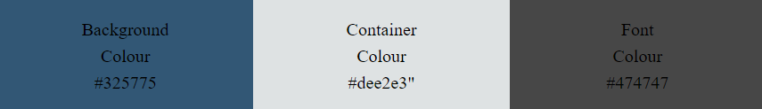

# Brendan the Navigator

## Code Institute - First Milestone Project: User Centric Frontend Development.

This website was developed to demonstrate my ability to design and construct a static website.

Brendan the Navigator is a site that hopes to introduce people to the man behind Saint Brendan, the fearless adventurer with a love for travelling on the sea.
This website aims to bring this figure and his lengendary voyage into the mainstream and make him appealing to all and not just people of faith. 

# Table of Contents
- [Brendan the Navigator](#brendan-the-navigator)
  -[Code Institute - First Milestone Project: User Centric Frontend Development.](#code-institute---first-milestone-project-user-centric-frontend-development)
- [Table of Contents](#table-of-contents)
 - [Demo](#demo)
 - [A live demo website can be found here](#a-live-demo-of-the-website-can-be-found-here)
- [UX](#ux)
- [User Stories](#user-stories)
  - [Strategy](#strategy)
  - [Scope](#scope)
  - [Structure](#structure)
  - [Skeleton](#skeleton)
  - [Surface](#surface)
- [Technologies](#technologies)
- [Features](#features)
 - [Existing Features](#existing-features)
 - [Future Features](#future-features) 
-[Testing](#testing)
 - [Validator Testing](#validator-testing)
 - [Bugs](#bugs-encountered)
-[Deployment](#deployment)
-[Credits](#credits)
 - [Content](#content)
 - [media](#media)
 - [Code](#code)
 - [Acknowledgements](#acknowledgements)

## Demo

### A live demo of the website can be found [here](https://lorrainescanlon.github.io/brendan-the-navigator/index.html)

## UX
This website is aimed at users who have an interest in learning about history. 
It aims to appeal to users with an interest in Irish and martitime history.

## User stories
- As a user I want to the purpose of the website to be clear and immediate.
- As a user I don't want to be overwhelmed by a cluttered landing page.
- As a user I want to easily navigate between the different pages on the site.
- As a user I want to be presented with the content in a chronolgical form. 
- As a user I want visuals to bring the content to life.
- As a user I want to decide if I would like to learn more about this historical figure.
- As a user I would like the opportunity to contact the page or provide feedback.

### Strategy
The goal is to create a well-functioning informative website. The focus is on presenting the content clearly and in a user-friendly manner. 

### Scope
I wanted to include features that enhanced the user experience and provide value to the user. Features such as the timeline and visual images support this.

### Structure
I wanted to present the user with a landing page that wasn't cluttered and wasn't going to overwhelm them with information. The landing page presents the user with a synopsis of information from which they can navigate to find further information.

**Website Sections:**
- **_Home / Landing Page:_** A timeline with a synopsis of the life of Brendan the Navigator.
- **_Header:_** A header containing links to other parts of the website.
- **_Voyage Page:_** A more detailed account of Brendan's 7 year voyage.
- **_Contact Page:_** A page featuring a feedback form and vote section.
- **_Footer:_** A footer containing social media links.

### Skeleton
The website is desinged with a simple hierarchical structure which the use can navigate through with ease.

Wireframes were created using Balsamiq software. Frames were drafted for both mobile and larger screens.
View the wireframe designs here 

### Surface
A uniform design has been used throught with consistent colour schemes and font to provide a seamless user experience.

A dark background colour is used to frame the elements presenting the content to the user. It mimics the color of the sea in the background and compliments the images used.
The background of the content containers is a lighter colour with a contrasting dark font colour making it easy for users to read.

_Colour Palette_

## Technologies
- HTML - To create the basic site layout, containers and content.
- CSS - To addd style to the features and content, and to add responsiveness for different device sizes.
- Balsamiq - Used to create the wireframes.

## Features 
I included the following features on my website.
### Existing Features
- __Navigation Bar__
  - Featured on all three pages the navigation bar is fixed to the top of the page.
  - The fully responsive navigation bar includes links to the Home page, Voyage and Contact page. 
  - The color scheme used is in keeping with the website and identical on each page to allow for easy navigation.
  - The navigation bar will allow the user to easily move from page to page across all devices without having to use the ‘back’ button.
  - The hover effect is used to highling menu items, this helps to enhance the user experience.  

- __Home Page__
  - The landing page includes an image with text overlay to allow the user to see exactly what this site is about. 
  - This section introduces the user to Brendan the Navigator with an image of his statue which stands at Fenit harbour in Kerry to set the scene.
  - This section includes a responsive timeline of the history of Brendan the Navigator.

- __Timeline__
  - The timeline on the home page presents a short history of Brendan the Navigator displayed in chronological order. 
  - The timeline contains links to the Voyage page where users can read more about Brendan. 
  - It also contains links to external sites with further information that open in a new browser tab.
  - The timeline is responsive and will rearrange content for different device sizes.
    
- __The Voyage Page__
  - Similar to the home page, the voyage page icludes a heading image with text overlay to set the scene for the story to follow.
  - The voyage page details Brendan's famous seven year voyage.
  - Pictures are used to support the content and to paint a picture for the user. 
  - Links are provided to external sites where the user can find more information.

- __Contact Page__
  - This page will allow the user to contact the website with any queries or feedback. 
  - The user will be asked to submit their full name and email address.
  - The user will also have the opportunity to vote on whether the believe Brendan reached America or not.

- __The Footer__ 
  - The footer section includes links to the relevant social media sites for Brendan the Navigator. 
  - The links will open to a new tab to allow easy navigation for the user. 
  - The footer is valuable to the user as it encourages them to keep connected via social media.

### Future Features
- As a future add on, a feature that would display the results of the vote button. Shown as a graphic to illustrate what percentage of users 
  believe Brendan reached America versus the percentage that believe he didn't.
- An interactive map of Brendans seven year voyage would be a great feature to support the existing content.
- I believe on very large devices a horizontal implementation of the timeline could make better use of screen space.

## Testing
- This page has been tested on different browsers such as Chrome, Firefox and Microsoft Edge.
- This page has been tested on laptop and mobile devices.
- Responsiveness and functionality have been tested on all screen sizes using the dev tools device toolbar.
- All links internal and external have been tested and are working.
- I have successfully tested the contact form validation for text and email input fields. 
- The submit button also posts the data to the code institute server. 
- All pages passed lighthouse testing for performance, accessibility, best practices and search engine optimization. 

### Validator Testing 
- HTML
  - No errors were returned when passing through the official [W3C validator](docs/HTMLvalidated.pdf)
  - One warning was returned as detailed below in the unfixed bugs section.
- CSS
  - No errors were found when passing through the official [Jigsaw validator](docs/images/cssvalidated.PNG)

## Bugs Encountered
- When I first deployed the website to GitHub, I discovered that the social media links did not work. 
  This was due to not enclosing the icons within the anchor closing tag.
- I also discovered that the form radio buttons did not behave as expected. 
  This was due to assigning unique names to the buttons, this was resolved by giving them both the same name.
- I encountered problems when applying the media query to change the layout of the timeline for larger screens. 
  The timeline ruler and containers were displaying correctly, the problem was that the exisiting circles for some containers were not being re organised so I had duplicate circles. With some assistance from tutor support I added a line of code left;auto to set the items to default.

### Unfixed Bugs
- When running the voyage.html code through the validator it returns the following warning.
  
  No headings are needed in this section so I have left it for now.
 
## Deployment
- The site was deployed to GitHub pages. The steps to deploy are as follows: 
  - In the GitHub repository, navigate to the Settings tab. 
  - Under the General menu on the left side find the Code and Automation section and select Pages.
  - Under the Build and Deployment section to the right find Source, select 'Deploy from a branch' from the dropdown list.
  - For Branch select 'main' from the dropdown list and click Save.
  - The link to the deployed website will now be displayed at the top of the page.
  - The live link can be found here - https://lorrainescanlon.github.io/brendan-the-navigator/

## Credits 
The following is a list of resources I used for this website.

### Content 
- I used Wikipedia https://en.wikipedia.org/wiki/Brendan_the_Navigator as a content source.
- I used Dingle-Peninsula https://dingle-peninsula.ie/stories-2/49-blog-from-the-dingle-peninsula/251-st-brendan-the-navigator-s-departure-from-brandon-creek.html as a content source.
- I used Irish Culture and Customs https://www.irishcultureandcustoms.com/ASaints/BrendanNav.html as a content source.

### Media
- The Statue and Brandon Creek images are my own.
- The Sea image used is from Unsplash by Ulrike Donohue.
- The Puffin image used is from Pixabay by Frank Liebmann.
- The Volcano image used is from Pixabay by Julius H.
- The Iceberg image used is from Pixabay by Lurens.
- The Ship image used is from Pixabay by the user dp1616.
- The compass favicon was taken from [Favicon] https://favicon.io/.com
- The icons in the footer were taken from [Font Awesome](https://fontawesome.com/)

### Code
 - I researched how to implement the timeline on W3Schools. I used the instructions at the following link as a basis for this feature https://www.w3schools.com/howto/howto_css_timeline.asp 
   This code creates a split timeline that then reconfigures to become a single sided timeline. I was using the revserse approach as I developed the mobile site first and then added media queries to split the timeline for larger screens so I chopped and changed the code quiet a bit to get the effect I was looking for.

### Acknowledgements
- Inspiration for some elements came from the Code Institute's Love Running project.
- I am gratefull to the Code Institute tutor support team for helping and guiding me in the right direction.
- A special thanks to my mentor Medale Oluwafemi for his guidance and great advice.

[def]: #Brendan-the-Navigator