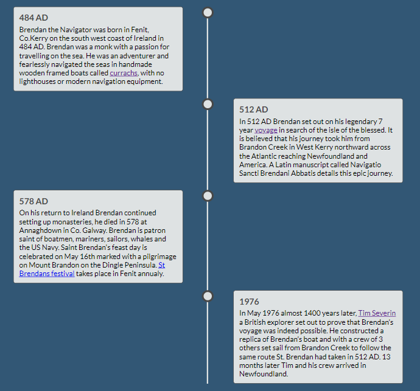

# Brendan the Navigator
Brendan the Navigator is a site that hopes to introduce people to the man behind Saint Brendan, the fearless adventurer with a love for the travelling on the sea.
This website aims to bring this figure and his lengendary voyage into the mainstream and make him appealing to all and not just people of faith. 

## Features 
I included the following features on my website.
### Existing Features
- __Navigation Bar__
  - Featured on all three pages, the full responsive navigation bar includes links to the Home page, Voyage and Contact page. It is identical on each page to allow for easy navigation.
  - This section will allow the user to easily navigate from page to page across all devices without having to revert back to the previous page via the ‘back’ button. 

- __The landing page image__
  - The landing page includes a photograph with text overlay to allow the user to see exactly what this site is about. 
  - This section introduces the user to Brendan the Navigator with an image of his statue which stands at Fenit harbour in Kerry to set the scene.
  - This section includes a responsive timeline of the history of Brendan the Navigator.

- __Timeline__
  - The homepage timeline presents a short history of Brendan the Navigator. 
  - The timeline contains links to the Voyage page where users and read more about Brendan. 
  - It also contains links to external sites with further information that open in a new browser tab.
  - The timeline is responsive and will rearrange content for different device sizes.
    
- __The Voyage__
  - The voyage page details Brendans famous seven year voyage.
  - Pictures are used to support the content to paint a picture for the user. 
  - Links are provided to external sites where the user can find more information.

- __Contact Page__
  - This page will allow the user to contact the page with any queries or feedback. 
  - The user will be asked to submit their full name and email address.
  - The user will also have the opportunity to vote on whether the believe Brendan reached America or not.

- __The Footer__ 
  - The footer section includes links to the relevant social media sites for Brendan the Navigator. 
  - The links will open to a new tab to allow easy navigation for the user. 
  - The footer is valuable to the user as it encourages them to keep connected via social media.

### Features Left to Implement
- As a future add on, a feature that would display the results on the vote button. Shown as a graphic to illustrate what percentage of users believe Brendan reached    
  America versus the percentage that believe he didn't.
- An interactive map of Brendans 7 year voyage would be a great feature to support the existing content.
- I think on very large devices a horizontal implementation of the timeline could make better use of screen space.
## Testing
- This page has been tested on different browsers such as Chrome, Firefox and Microsoft Egde.
- Responsiveness and functionality have been tested on all screen sizes using the dev tools device toolbar.
- All links internal and external have been tested and are working.
- I have tested the contact form validation for text and email input fields. 
- The submit button also posts the data to the code institute server. 
- All pages passed lighthouse testing for performance, accessibility, best practices and search engine optimization. 

## Bugs Encountered
- When I first deployed the website to GitHub, I discovered that the social media links didn't work. 
  This was due to not enclosing the icons within the anchor opening and closing tags.
- I also discovered that my radio buttons didn't behave as expected. 
  This was due to me assigning unique ids to the buttons, this was resolved by giving them both the same id.
- I encountered problems when applying the media query to change the layout of the timeline for larger screens. 
  The timeline ruler and containers were displaying correctly, the problem was that the exisiting circles for some containers were not being re organised so I had duplicate circles. With some assistance from tutor support I added a line of code left;auto to set the items to default.

### Validator Testing 
- HTML
  - No errors were returned when passing through the official [W3C validator](https://validator.w3.org/)
  - One warning was returned as detailed below in the unfixed bugs section.
- CSS
  - No errors were found when passing through the official [(Jigsaw) validator](https://jigsaw.w3.org/)
### Unfixed Bugs
- When running the voyage.html code through the validator it returns the following warning.
  
  No headings are needed in this section so I have left it for now.
 
## Deployment
- The site was deployed to GitHub pages. The steps to deploy are as follows: 
  - In the GitHub repository, navigate to the Settings tab. 
  - From the source section drop-down menu, select the Master Branch.
  - Once the master branch has been selected, the page will be automatically refreshed with a detailed ribbon display to indicate the successful deployment. 
  - The live link can be found here - https://lorrainescanlon.github.io/brendan-the-navigator/
## Credits 
The following is a list of resources I used for this website.
### Content 
- I used Wikipedia https://en.wikipedia.org/wiki/Brendan_the_Navigator as a content source.
- I used Dingle-Peninsula https://dingle-peninsula.ie/stories-2/49-blog-from-the-dingle-peninsula/251-st-brendan-the-navigator-s-departure-from-brandon-creek.html as a content source.
- I used Irish Culture and Customs https://www.irishcultureandcustoms.com/ASaints/BrendanNav.html as a content source.
### Media
- The Statue and Brandon Creek images are my own.
- The Sea image used is from Unsplash by Ulrike Donohue.
- The Puffin image used is from Pixabay by Frank Liebmann.
- The Volcano image used is from Pixabay by Julius H.
- The Iceberg image used is from Pixabay by Lurens.
- The Ship image used is from Pixabay by the user dp1616.
- The compass favicon was taken from [Favicon] https://favicon.io/.com
- The icons in the footer were taken from [Font Awesome](https://fontawesome.com/)
### Code
 - I researched how to implement the timeline on W3Schools. I used the instructions at the following link as a basis for this feature https://www.w3schools.com/howto/howto_css_timeline.asp 
   This code creates a split timeline that then reconfigures to become a single sided timeline. I was using the revserse approach as I developed the mobile site first and then added media queries to split the timeline for larger screens so I chopped and changed the code quiet a bit to get the effect I was looking for.

